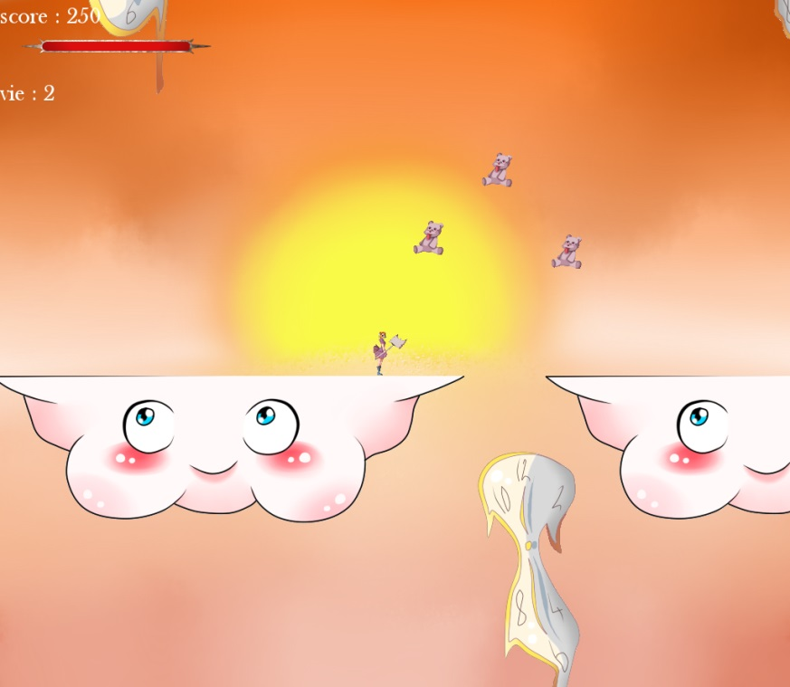
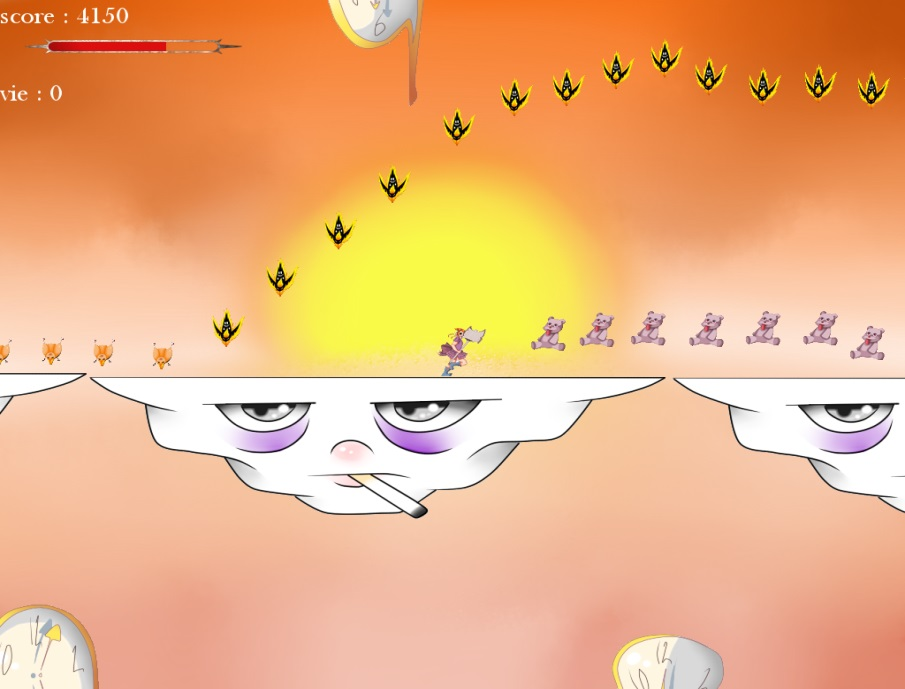
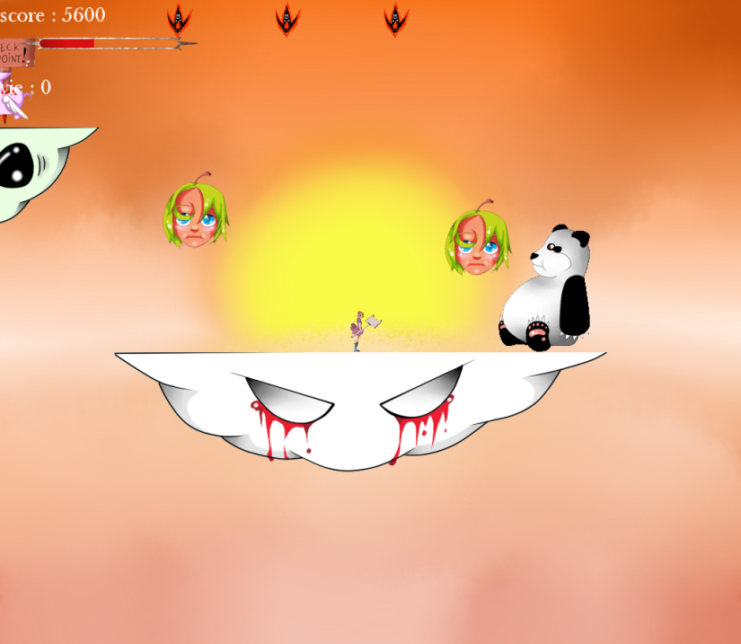

# Leoin Till Valhalar

This repository is a project I made with 2 other classmates for my high school diploma.
It's a small platformer which I was in charge of making the game engine(collision, level loading, animation rendering, game logic ect...).

It was my first real project and first one I finished.

The project was origanally build on windows 7 and so the program may have some bugs like framerate dropping or collision bug.

Game assets were created by our team except the menu(button, background ect...).

## Installation

First you need to install the sfml (which allows to make the gui) :
```bash
sudo apt-get install libsfml-dev
```
Then you can build the program and launch it :
```bash
make
./bin/LeoinTillValhalar
```

## Screenshot







## Copyright

few of the images in the data folder may have a copyright but since this project was made in 2014 i don't have the sources of all the pictures so I you are the creator or detentor of the copyright of one of these picture, tell me and I will remove it.